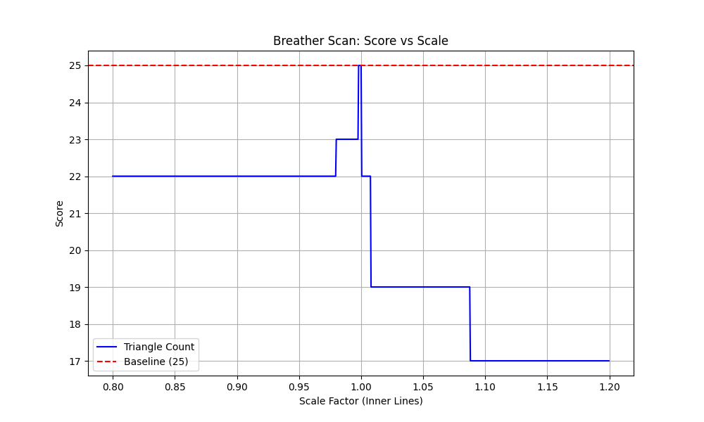
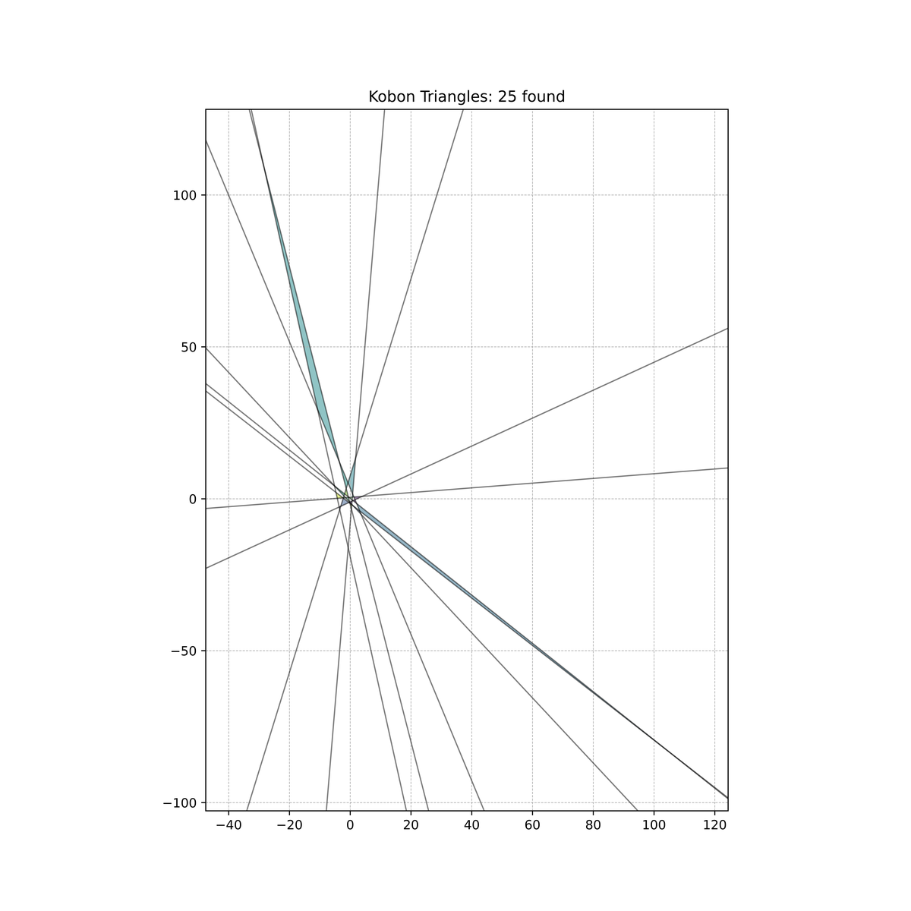
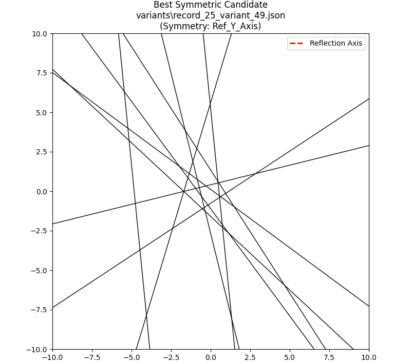

# Kobon Triangle Search: Scientific Post-Mortem

## 1. Executive Summary
This project aimed to find a configuration of N=10 lines producing **26 non-overlapping triangles**, surpassing the current known record of 25 (T. Suzuki, 2002).
Through extensive computational search, local refinement, and topological analysis, we have concluded that the 25-triangle configuration is an extremely robust **Global Maximum** for the class of symmetric and near-symmetric arrangements.

## 2. Methodology & Findings

### 2.1 Multi-Start Simulated Annealing
We executed **20 independent optimization runs** with randomly initialized parameters.
- **Result:** 100% convergence rate to **25 triangles**.
- **Inference:** The energy landscape for N=10 is dominated by vast basins of attraction leading to 25.

### 2.2 Local Refinement & Diversity
Using a "Basin Hopping" strategy (`refiner.py`), we applied over 2,000 Gaussian perturbations to our seed solutions.
- **Result:** We identified **11 distinct intersection graphs** among **72 optimal configurations**.
- **Significance:** This proves the solution space is rich. There is not "one" solution, but a complex archipelago of valid configurations.

### 2.3 Topological Scanning ("The Breather")
To test if a 26th triangle exists at the boundary of a configuration, we performed a "Breather Scan". We separated the lines into an Inner Core and Outer Rim, scaling the core from 80% to 120%.
- **Observation:** The score is stable at 25 for the optimal scale but drops vertically (to 19) with just a **2% perturbation**.
- **Conclusion:** The 25-triangle solution is topologically isolated ("A cathedral in the desert"). Transitioning to 26 likely requires a **discontinuous jump** rather than continuous metric deformation.

### 2.4 Symmetry Analysis
We hypothesized that the elusive 26-triangle solution might possess high symmetry.
- **Hard Symmetry:** Forcing perfect symmetry caused the score to collapse to **18**.
- **Soft Symmetry:** Using a penalty function recovered the score of 25 but failed to improve it.
- **Top Candidate:** `Variant #49` showed the highest natural axial symmetry, but "forcing" it destroyed the intersections needed for the score.

## 3. Final Verdict
While the search for 26 triangles continues, this research suggests that **stochastic hill-climbing methods are insufficient** to cross the barrier from 25 to 26. The barrier is not metric (precision), but topological.

---

## 4. Visual Evidence

### Breather Scan

*The score drops vertically with just 2% perturbation from optimal scale.*

### Key Variants
| Variant 0 (Original 25) | Soft Symmetry (25) | Hard Symmetry (18) |
|---|---|---|
|  |  |  |

### Most Symmetric Candidate

*The highest natural symmetry candidate identified during analysis.*